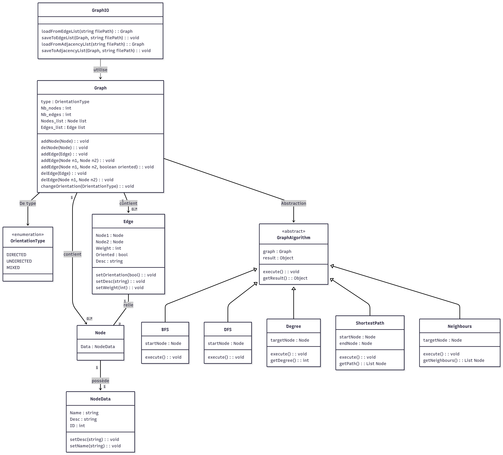

# JavaUniv

### 4/12/2025 :
Création d'un diagramme de classe UML précis et complet du TP2.  
Ainsi que les classes en java (environ 80% achevé), ne devrais pas trop diférer du résultat final 

### 10/12/2025 :
Avancement lent mais solide.  

Optimisation d'ajout de Node, on passe de O(n) à O(1).  
Ajout de tests unitaire.

### 7/01/2026 :
Ajout de l'algorithme de Dijkstra (+ tests des algos DFS et BFS)

Brouillon (à refaire) pour illustrer le test de A à H (validé par les Tests)

### 14/01/2026 :
Mise en ordre des fichiers dans des dossiers (algo, asset...) pour avoir une structure propre