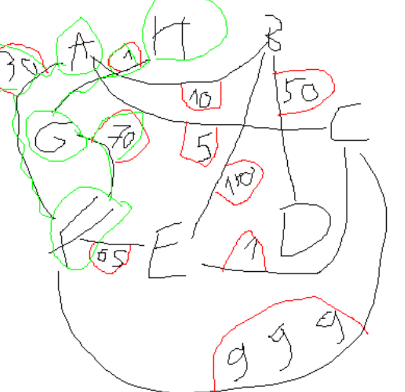

## Version

### Version de Java
```bash
openjdk 21.0.8 2025-07-15
OpenJDK Runtime Environment (build 21.0.8+9-Ubuntu-0ubuntu124.04.1)
OpenJDK 64-Bit Server VM (build 21.0.8+9-Ubuntu-0ubuntu124.04.1, mixed mode, sharing)
```

### Version du compilateur
```bash
javac 16.0.2
```

## Installation / Setup

Pour installer et configurer le projet :

```bash
./setup_projet.sh
```

## Exécution des tests

Pour tester le projet :

```bash
./run_tests.sh
```


### 4/12/2025 :
Création d'un diagramme de classe UML précis et complet du TP2.  
Ainsi que les classes en java (environ 80% achevé), ne devrais pas trop diférer du résultat final 


### 10/12/2025 :
Avancement lent mais solide.  

Optimisation d'ajout de Node, on passe de O(n) à O(1).  
Ajout de tests unitaire.


### 7/01/2026 :
Ajout de l'algorithme de Dijkstra (+ tests des algos DFS et BFS)

Brouillon (à refaire) pour illustrer le test de A à H (validé par les Tests)



### 14/01/2026 :
Mise en ordre des fichiers dans des dossiers (algo, asset...) pour avoir une structure propre

Changement de la manière de typer le graphe. J'avais mis un énum type plutôt que des sous-classes. Maintenant il y a des sous classes correspondantes aux types. (Les tests ont été modifiés)

Optimisation de méthodes

### 30/01/2026 :
Réalisation complète de SafeLogistic